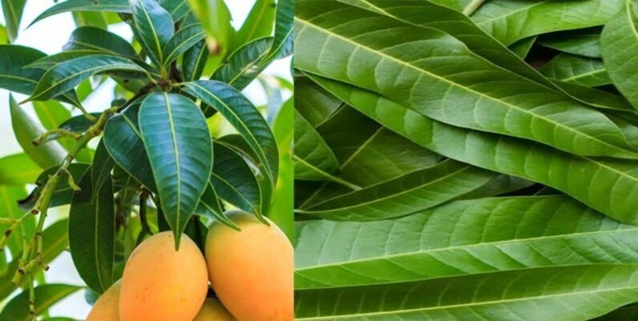

# Leaf_Image_Classification_DM_Final

*Mango Leaf Image classfication [Source](https://www.kaggle.com/datasets/aryashah2k/mango-leaf-disease-dataset)*

## In this repositery we are building a leaf disease image classification model with different machine learning algorithms to find out the best model we can get.
- We are using the [Mango Leaf image classification Dataset](https://www.kaggle.com/datasets/aryashah2k/mango-leaf-disease-dataset) from Kaggle.
- We will understand different things like Data augmenation, Transfer learning etc.
- We will perform experiments with different model like SVM,KNN, CNN etc.
- We will bulild a web application to serve our model as a product using Gradio.
- We will also consider experimenation tracking with MLflow.

It's recommended to start with this [Medium blog post](https://medium.com/@gauravthorat1998/leaf-disease-dataset-image-classifier-845a23ddfa32)

You can acccess [__Project video__](https://www.youtube.com/watch?v=JztsuLuHHTs) here.
